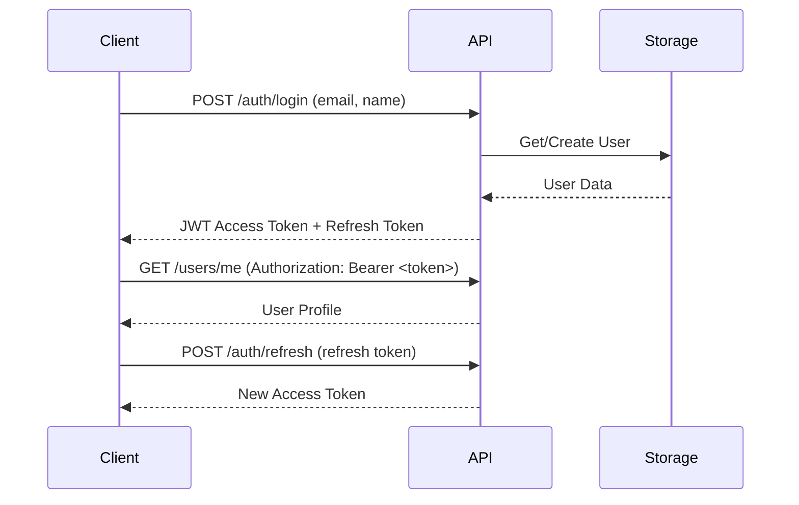

# Client Integration Guide

Guide for integrating client applications with the Quotes Backend API.

## Table of Contents

- [Overview](#overview)
- [Authentication](#authentication)
- [API Endpoints](#api-endpoints)
- [TypeScript SDK](#typescript-sdk)
- [Error Handling](#error-handling)
- [Rate Limiting](#rate-limiting)
- [Examples](#examples)

---

## Overview

The Quotes Backend API is a RESTful service built with Azure Functions that provides:
- Anonymous quote access (public endpoints)
- User authentication with JWT tokens
- Quote submission and management
- Admin moderation and user management

**Base URL (Local Development):** `http://localhost:7071/api/v1`  
**Base URL (Production):** `https://<your-function-app>.azurewebsites.net/api/v1`

---

## Authentication

### Authentication Flow



### Login

**Endpoint:** `POST /api/v1/auth/login`

**Request:**
```json
{
  "email": "user@example.com",
  "name": "John Doe",
  "provider": "email"
}
```

**Response:**
```json
{
  "accessToken": "eyJhbGciOiJIUzI1NiIs...",
  "refreshToken": "eyJhbGciOiJIUzI1NiIs...",
  "expiresIn": 3600,
  "user": {
    "Id": "user-123",
    "Email": "user@example.com",
    "Name": "John Doe",
    "Role": "Authenticated",
    "Provider": "email",
    "CreatedAt": "2025-11-24T00:00:00Z",
    "LastLogin": "2025-11-24T00:00:00Z"
  }
}
```

### Token Refresh

**Endpoint:** `POST /api/v1/auth/refresh`

**Request:**
```json
{
  "refreshToken": "eyJhbGciOiJIUzI1NiIs..."
}
```

**Response:**
```json
{
  "accessToken": "eyJhbGciOiJIUzI1NiIs...",
  "refreshToken": "eyJhbGciOiJIUzI1NiIs...",
  "expiresIn": 3600
}
```

### Get Current User

**Endpoint:** `GET /api/v1/users/me`

**Headers:**
```
Authorization: Bearer <access_token>
```

**Response:**
```json
{
  "Id": "user-123",
  "Email": "user@example.com",
  "Name": "John Doe",
  "Role": "Authenticated",
  "Provider": "email",
  "IsActive": true,
  "CreatedAt": "2025-11-24T00:00:00Z",
  "LastLogin": "2025-11-24T00:00:00Z"
}
```

---

## API Endpoints

### Public Endpoints (No Authentication Required)

#### Get All Quotes

**Endpoint:** `GET /api/v1/quotes`

**Query Parameters:**
- `language` (optional): Filter by language (`vi` or `en`)
- `category` (optional): Filter by category (e.g., `wisdom`, `motivation`)
- `author` (optional): Filter by author name
- `type` (optional): Filter by type (`quote`, `proverb`, `cadao`, `saying`)

**Example:**
```http
GET /api/v1/quotes?language=vi&category=wisdom&author=Buddha
```

**Response:**
```json
[
  {
    "id": "1",
    "content": "Hạnh phúc không phải là điều gì đó có sẵn.",
    "author": "Đức Phật",
    "category": "Trí Tuệ",
    "tags": ["happiness", "wisdom"],
    "language": "vi",
    "type": "quote",
    "isPublic": true,
    "createdAt": "2025-11-24T00:00:00Z"
  }
]
```

#### Get Quote by ID

**Endpoint:** `GET /api/v1/quotes/{id}`

**Response:**
```json
{
  "id": "1",
  "content": "Hạnh phúc không phải là điều gì đó có sẵn.",
  "author": "Đức Phật",
  "category": "Trí Tuệ",
  "tags": ["happiness", "wisdom"],
  "language": "vi",
  "type": "quote",
  "isPublic": true,
  "createdAt": "2025-11-24T00:00:00Z"
}
```

### Authenticated Endpoints (Requires JWT Token)

#### Create Quote

**Endpoint:** `POST /api/v1/quotes`

**Headers:**
```
Authorization: Bearer <access_token>
Content-Type: application/json
```

**Request:**
```json
{
  "content": "New quote content here",
  "author": "Author Name",
  "category": "Category",
  "tags": ["tag1", "tag2"],
  "language": "en",
  "type": "quote",
  "isPublic": false
}
```

**Response:** `201 Created`
```json
{
  "id": "new-quote-id",
  "content": "New quote content here",
  "author": "Author Name",
  "category": "Category",
  "tags": ["tag1", "tag2"],
  "language": "en",
  "type": "quote",
  "isPublic": false,
  "createdAt": "2025-11-24T00:00:00Z",
  "createdBy": "user-123"
}
```

#### Update Quote

**Endpoint:** `PUT /api/v1/quotes/{id}`

**Headers:**
```
Authorization: Bearer <access_token>
Content-Type: application/json
```

**Request:**
```json
{
  "content": "Updated content",
  "author": "Updated Author"
}
```

**Response:** `200 OK`

#### Delete Quote

**Endpoint:** `DELETE /api/v1/quotes/{id}`

**Headers:**
```
Authorization: Bearer <access_token>
```

**Response:** `204 No Content`

#### Get My Quotes

**Endpoint:** `GET /api/v1/users/me/quotes`

**Headers:**
```
Authorization: Bearer <access_token>
```

**Response:**
```json
[
  {
    "id": "my-quote-1",
    "content": "My personal quote",
    "author": "Me",
    "category": "Personal",
    "language": "en",
    "type": "quote",
    "isPublic": false,
    "createdBy": "user-123",
    "createdAt": "2025-11-24T00:00:00Z"
  }
]
```

### Admin Endpoints (Requires Admin Role)

#### Get All Submissions

**Endpoint:** `GET /api/v1/admin/submissions`

**Headers:**
```
Authorization: Bearer <access_token>
```

**Response:** Array of pending user-submitted quotes

#### Approve Quote

**Endpoint:** `PUT /api/v1/admin/quotes/{id}/approve`

**Headers:**
```
Authorization: Bearer <access_token>
```

**Response:** `200 OK`

#### Reject Quote

**Endpoint:** `PUT /api/v1/admin/quotes/{id}/reject`

**Headers:**
```
Authorization: Bearer <access_token>
Content-Type: application/json
```

**Request:**
```json
{
  "reason": "Reason for rejection (optional)"
}
```

**Response:** `200 OK`

#### Get All Users

**Endpoint:** `GET /api/v1/admin/users`

**Headers:**
```
Authorization: Bearer <access_token>
```

**Response:** Array of all registered users

#### Update User

**Endpoint:** `PUT /api/v1/admin/users/{id}`

**Headers:**
```
Authorization: Bearer <access_token>
Content-Type: application/json
```

**Request:**
```json
{
  "role": "Admin"
}
```

**Response:** `200 OK`

#### Ban/Delete User

**Endpoint:** `DELETE /api/v1/admin/users/{id}`

**Headers:**
```
Authorization: Bearer <access_token>
```

**Response:** `204 No Content`

---

## TypeScript SDK

### Installation

The Quotes Admin Center includes a TypeScript SDK for easy integration.

**Copy these files to your project:**
- `quotes-admin/src/services/authService.ts`
- `quotes-admin/src/services/quotesApi.ts`
- `quotes-admin/src/hooks/useAuth.ts`

### Authentication Service

```typescript
import { authService } from './services/authService';

// Login
const response = await authService.login({
  email: 'user@example.com',
  name: 'John Doe',
  provider: 'email'
});

console.log('Access Token:', response.accessToken);
console.log('User:', response.user);

// Get current user
const user = await authService.getCurrentUser();

// Check authentication
const isAuthenticated = authService.isAuthenticated();
const isAdmin = authService.isAdmin();

// Logout
await authService.logout();
```

### Quotes API Service

```typescript
import { quotesApi } from './services/quotesApi';

// Get all quotes
const quotes = await quotesApi.getAllQuotes();

// Filter quotes
const vietnameseQuotes = await quotesApi.getAllQuotes({
  language: 'vi',
  category: 'wisdom'
});

// Get single quote
const quote = await quotesApi.getQuoteById('quote-id');

// Create quote (authenticated)
const newQuote = await quotesApi.createQuote({
  content: 'Quote content',
  author: 'Author',
  category: 'Category',
  language: 'en',
  type: 'quote',
  isPublic: true
});

// Update quote
await quotesApi.updateQuote('quote-id', {
  content: 'Updated content'
});

// Delete quote
await quotesApi.deleteQuote('quote-id');

// Admin operations
const submissions = await quotesApi.getSubmissions();
await quotesApi.approveQuote('quote-id');
await quotesApi.rejectQuote('quote-id', 'Reason');
```

### React Hook

```typescript
import { useAuth } from './hooks/useAuth';

function MyComponent() {
  const { user, login, logout, isAuthenticated, isLoading } = useAuth();

  if (isLoading) {
    return <div>Loading...</div>;
  }

  if (!isAuthenticated) {
    return <button onClick={() => login({ email: 'user@example.com' })}>
      Login
    </button>;
  }

  return (
    <div>
      <p>Welcome, {user?.Name}!</p>
      <p>Role: {user?.Role}</p>
      <button onClick={logout}>Logout</button>
    </div>
  );
}
```

---

## Error Handling

### HTTP Status Codes

| Status Code | Description |
|------------|-------------|
| 200 | Success |
| 201 | Created |
| 204 | No Content (successful deletion) |
| 400 | Bad Request (validation error) |
| 401 | Unauthorized (missing/invalid token) |
| 403 | Forbidden (insufficient permissions) |
| 404 | Not Found |
| 429 | Too Many Requests (rate limit exceeded) |
| 500 | Internal Server Error |

### Error Response Format

```json
{
  "error": "Error type",
  "message": "Detailed error message",
  "statusCode": 400
}
```

### Example Error Handling

```typescript
try {
  const quote = await quotesApi.getQuoteById('invalid-id');
} catch (error) {
  if (axios.isAxiosError(error)) {
    if (error.response?.status === 404) {
      console.error('Quote not found');
    } else if (error.response?.status === 401) {
      console.error('Not authenticated');
      // Redirect to login
    } else if (error.response?.status === 403) {
      console.error('Insufficient permissions');
    } else {
      console.error('Error:', error.response?.data?.message);
    }
  }
}
```

---

## Rate Limiting

The API enforces rate limits to prevent abuse:

| User Type | Rate Limit |
|-----------|-----------|
| Anonymous | 100 requests/min per IP |
| Authenticated | 500 requests/min per user |
| Admin | 1000 requests/min per user |

When rate limit is exceeded, you'll receive:
- **Status Code:** 429 Too Many Requests
- **Header:** `Retry-After: 60` (seconds)

**Best Practices:**
- Cache quote data locally
- Implement exponential backoff for retries
- Use pagination for large datasets
- Monitor `X-RateLimit-Remaining` header (if available)

---

## Examples

### React Application

```typescript
// App.tsx
import React, { useEffect, useState } from 'react';
import { quotesApi, Quote } from './services/quotesApi';

function App() {
  const [quotes, setQuotes] = useState<Quote[]>([]);
  const [loading, setLoading] = useState(true);

  useEffect(() => {
    async function fetchQuotes() {
      try {
        const data = await quotesApi.getAllQuotes({
          language: 'en',
          category: 'wisdom'
        });
        setQuotes(data);
      } catch (error) {
        console.error('Failed to fetch quotes:', error);
      } finally {
        setLoading(false);
      }
    }

    fetchQuotes();
  }, []);

  if (loading) return <div>Loading...</div>;

  return (
    <div>
      <h1>Quotes</h1>
      {quotes.map(quote => (
        <div key={quote.Id}>
          <p>{quote.Content}</p>
          <p>— {quote.Author}</p>
        </div>
      ))}
    </div>
  );
}
```

### Angular Service

```typescript
// quotes.service.ts
import { Injectable } from '@angular/core';
import { HttpClient, HttpHeaders } from '@angular/common/http';
import { Observable } from 'rxjs';

interface Quote {
  Id: string;
  Content: string;
  Author: string;
  Category: string;
  Language: 'vi' | 'en';
  Type: 'quote' | 'proverb' | 'cadao';
}

@Injectable({ providedIn: 'root' })
export class QuotesService {
  private apiUrl = 'http://localhost:7071/api/v1';

  constructor(private http: HttpClient) {}

  getAllQuotes(params?: { language?: string; category?: string }): Observable<Quote[]> {
    return this.http.get<Quote[]>(`${this.apiUrl}/quotes`, { params });
  }

  getQuoteById(id: string): Observable<Quote> {
    return this.http.get<Quote>(`${this.apiUrl}/quotes/${id}`);
  }

  createQuote(quote: Partial<Quote>): Observable<Quote> {
    const token = localStorage.getItem('access_token');
    const headers = new HttpHeaders({
      'Authorization': `Bearer ${token}`,
      'Content-Type': 'application/json'
    });

    return this.http.post<Quote>(`${this.apiUrl}/quotes`, quote, { headers });
  }
}
```

### Vanilla JavaScript

```javascript
// Fetch quotes
async function getQuotes() {
  const response = await fetch('http://localhost:7071/api/v1/quotes?language=en');
  const quotes = await response.json();
  return quotes;
}

// Login
async function login(email, name) {
  const response = await fetch('http://localhost:7071/api/v1/auth/login', {
    method: 'POST',
    headers: { 'Content-Type': 'application/json' },
    body: JSON.stringify({ email, name, provider: 'email' })
  });
  
  const data = await response.json();
  localStorage.setItem('access_token', data.accessToken);
  localStorage.setItem('refresh_token', data.refreshToken);
  
  return data;
}

// Create quote (authenticated)
async function createQuote(quote) {
  const token = localStorage.getItem('access_token');
  
  const response = await fetch('http://localhost:7071/api/v1/quotes', {
    method: 'POST',
    headers: {
      'Authorization': `Bearer ${token}`,
      'Content-Type': 'application/json'
    },
    body: JSON.stringify(quote)
  });
  
  return response.json();
}
```

### cURL Examples

```bash
# Get all quotes
curl http://localhost:7071/api/v1/quotes

# Filter quotes
curl "http://localhost:7071/api/v1/quotes?language=vi&category=wisdom"

# Login
curl -X POST http://localhost:7071/api/v1/auth/login \
  -H "Content-Type: application/json" \
  -d '{"email":"user@example.com","name":"John Doe","provider":"email"}'

# Create quote (with token)
curl -X POST http://localhost:7071/api/v1/quotes \
  -H "Authorization: Bearer YOUR_ACCESS_TOKEN" \
  -H "Content-Type: application/json" \
  -d '{"content":"New quote","author":"Author","category":"Category","language":"en","type":"quote"}'

# Approve quote (admin)
curl -X PUT http://localhost:7071/api/v1/admin/quotes/{id}/approve \
  -H "Authorization: Bearer ADMIN_ACCESS_TOKEN"
```

---

## CORS Configuration

The API is configured to accept requests from:
- `http://localhost:3000` (React Admin Center)
- `http://localhost:4200` (Angular Platform)
- `http://localhost:5173` (Vite)
- `https://*.github.io` (GitHub Pages)
- `capacitor://localhost` (Capacitor mobile apps)
- `ionic://localhost` (Ionic mobile apps)

For production, ensure your domain is added to the CORS middleware in `CorsMiddleware.cs`.

---

## Testing

Test the API locally using the provided script:

```powershell
cd quotes-backend
.\scripts\test-api-locally.ps1
```

Or use the test pages:
- `test-root-admin.html` - Test authentication
- `test-cors.html` - Test CORS configuration

---

## Support

For issues or questions:
- **GitHub Issues:** [Project Repository]
- **Documentation:** See `/docs` folder
- **Backend README:** `quotes-backend/README.md`
- **Admin Center:** `quotes-admin/README.md`

---

## Changelog

### November 2025
- ✅ CORS fix: Removed duplicate configuration
- ✅ API testing: Automated test suite added
- ✅ US1 validation: Anonymous quote access tested (90.91% pass rate)
- ✅ Admin components: QuoteList, QuoteEditor, Layout complete
- ✅ React Router: All routes configured with authentication guards
