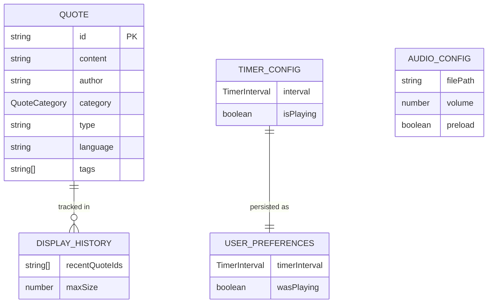

# Data Model: Buddhist Quotes Display Platform

**Feature**: 001-quote-display
**Phase**: 1 - Data Model & Schema Definition
**Date**: 2025-01-24

## Overview

This document defines all data entities, TypeScript interfaces, JSON schemas, and validation rules for the Buddhist quotes platform. All entities support Vietnamese UTF-8 encoding and align with the static JSON architecture defined in constitution v2.1.0.

---

## 1. Quote Entity

### TypeScript Interface

```typescript
/**
 * Represents a Buddhist wisdom quote with full metadata
 */
export interface Quote {
  /** Unique identifier (UUID or sequential ID) */
  id: string;
  
  /** Quote text content (Vietnamese or English) */
  content: string;
  
  /** Attribution (e.g., "Buddha", "Thích Nhất Hạnh", "Dalai Lama") */
  author: string;
  
  /** Thematic category (see QuoteCategory enum) */
  category: QuoteCategory;
  
  /** Entity type discriminator (literal 'Quote' for V1) */
  type: 'Quote';
  
  /** Optional language indicator for bilingual support */
  language?: 'vi' | 'en';
  
  /** Optional keywords for enhanced search */
  tags?: string[];
}
```

### Quote Category Enum

```typescript
/**
 * Predefined thematic categories for Buddhist quotes
 */
export enum QuoteCategory {
  WISDOM = 'wisdom',
  COMPASSION = 'compassion',
  MINDFULNESS = 'mindfulness',
  MEDITATION = 'meditation',
  ENLIGHTENMENT = 'enlightenment',
  SUFFERING = 'suffering',
  PEACE = 'peace',
  IMPERMANENCE = 'impermanence',
  KARMA = 'karma',
  DHARMA = 'dharma'
}

/** Array of all valid category values for validation */
export const VALID_CATEGORIES = Object.values(QuoteCategory);
```

### Validation Rules

| Field | Required | Type | Constraints | Validation |
|-------|----------|------|-------------|------------|
| `id` | ✅ Yes | string | Non-empty, unique across dataset | Regex: `/^[a-zA-Z0-9_-]+$/` |
| `content` | ✅ Yes | string | Non-empty, UTF-8, max 1000 chars | Length: 1-1000, trim whitespace |
| `author` | ✅ Yes | string | Non-empty, max 100 chars | Length: 1-100, trim whitespace |
| `category` | ✅ Yes | QuoteCategory | Must be valid enum value | Check against `VALID_CATEGORIES` |
| `type` | ✅ Yes | 'Quote' | Literal string 'Quote' | Exact match: `'Quote'` |
| `language` | ❌ No | 'vi' \| 'en' | If present, must be 'vi' or 'en' | Enum validation |
| `tags` | ❌ No | string[] | Array of non-empty strings | Each tag: length 1-50 |

### TypeScript Validation Function

```typescript
export interface ValidationError {
  field: string;
  message: string;
}

export function validateQuote(quote: any): ValidationError[] {
  const errors: ValidationError[] = [];
  
  // Required field checks
  if (!quote.id || typeof quote.id !== 'string' || quote.id.trim().length === 0) {
    errors.push({ field: 'id', message: 'ID is required and must be non-empty string' });
  } else if (!/^[a-zA-Z0-9_-]+$/.test(quote.id)) {
    errors.push({ field: 'id', message: 'ID must contain only letters, numbers, underscores, or hyphens' });
  }
  
  if (!quote.content || typeof quote.content !== 'string' || quote.content.trim().length === 0) {
    errors.push({ field: 'content', message: 'Content is required and must be non-empty string' });
  } else if (quote.content.length > 1000) {
    errors.push({ field: 'content', message: 'Content must not exceed 1000 characters' });
  }
  
  if (!quote.author || typeof quote.author !== 'string' || quote.author.trim().length === 0) {
    errors.push({ field: 'author', message: 'Author is required and must be non-empty string' });
  } else if (quote.author.length > 100) {
    errors.push({ field: 'author', message: 'Author must not exceed 100 characters' });
  }
  
  if (!quote.category || !VALID_CATEGORIES.includes(quote.category)) {
    errors.push({ field: 'category', message: `Category must be one of: ${VALID_CATEGORIES.join(', ')}` });
  }
  
  if (quote.type !== 'Quote') {
    errors.push({ field: 'type', message: 'Type must be literal string "Quote"' });
  }
  
  // Optional field checks
  if (quote.language !== undefined && !['vi', 'en'].includes(quote.language)) {
    errors.push({ field: 'language', message: 'Language must be "vi" or "en" if provided' });
  }
  
  if (quote.tags !== undefined) {
    if (!Array.isArray(quote.tags)) {
      errors.push({ field: 'tags', message: 'Tags must be an array if provided' });
    } else {
      quote.tags.forEach((tag: any, index: number) => {
        if (typeof tag !== 'string' || tag.trim().length === 0) {
          errors.push({ field: `tags[${index}]`, message: 'Each tag must be non-empty string' });
        } else if (tag.length > 50) {
          errors.push({ field: `tags[${index}]`, message: 'Each tag must not exceed 50 characters' });
        }
      });
    }
  }
  
  return errors;
}
```

---

## 2. JSON File Format

### Schema Definition

```json
{
  "$schema": "http://json-schema.org/draft-07/schema#",
  "title": "Buddhist Quotes Dataset",
  "type": "object",
  "required": ["version", "quotes"],
  "properties": {
    "version": {
      "type": "string",
      "pattern": "^\\d+\\.\\d+\\.\\d+$",
      "description": "Semantic version of the dataset schema"
    },
    "quotes": {
      "type": "array",
      "minItems": 1,
      "items": {
        "$ref": "#/definitions/quote"
      }
    }
  },
  "definitions": {
    "quote": {
      "type": "object",
      "required": ["id", "content", "author", "category", "type"],
      "properties": {
        "id": {
          "type": "string",
          "pattern": "^[a-zA-Z0-9_-]+$"
        },
        "content": {
          "type": "string",
          "minLength": 1,
          "maxLength": 1000
        },
        "author": {
          "type": "string",
          "minLength": 1,
          "maxLength": 100
        },
        "category": {
          "type": "string",
          "enum": ["wisdom", "compassion", "mindfulness", "meditation", "enlightenment", "suffering", "peace", "impermanence", "karma", "dharma"]
        },
        "type": {
          "type": "string",
          "const": "Quote"
        },
        "language": {
          "type": "string",
          "enum": ["vi", "en"]
        },
        "tags": {
          "type": "array",
          "items": {
            "type": "string",
            "minLength": 1,
            "maxLength": 50
          }
        }
      }
    }
  }
}
```

### Example JSON Data File

**File Path**: `src/assets/data/quotes.json`

```json
{
  "version": "1.0.0",
  "quotes": [
    {
      "id": "q001",
      "content": "Không có con đường nào dẫn đến hạnh phúc. Hạnh phúc chính là con đường.",
      "author": "Đức Phật",
      "category": "wisdom",
      "type": "Quote",
      "language": "vi",
      "tags": ["happiness", "path", "journey"]
    },
    {
      "id": "q002",
      "content": "The mind is everything. What you think you become.",
      "author": "Buddha",
      "category": "mindfulness",
      "type": "Quote",
      "language": "en",
      "tags": ["mind", "thought", "transformation"]
    },
    {
      "id": "q003",
      "content": "Hơi thở là cây cầu nối liền thân và tâm.",
      "author": "Thích Nhất Hạnh",
      "category": "meditation",
      "type": "Quote",
      "language": "vi",
      "tags": ["breath", "mindfulness", "presence"]
    },
    {
      "id": "q004",
      "content": "Peace comes from within. Do not seek it without.",
      "author": "Buddha",
      "category": "peace",
      "type": "Quote",
      "language": "en",
      "tags": ["inner-peace", "seeking", "self"]
    },
    {
      "id": "q005",
      "content": "Mỗi sáng chúng ta được sinh ra lại. Điều chúng ta làm hôm nay mới là quan trọng nhất.",
      "author": "Đức Phật",
      "category": "impermanence",
      "type": "Quote",
      "language": "vi",
      "tags": ["rebirth", "present-moment", "action"]
    }
  ]
}
```

### File Encoding Requirements

- **Character Encoding**: UTF-8 without BOM (Byte Order Mark)
- **Line Endings**: LF (Unix-style) for cross-platform compatibility
- **Formatting**: Indented with 2 spaces (minified for production)
- **File Size**: Target <500KB for ~10,000 quotes (average ~50 bytes per quote)
- **Validation**: Run JSON schema validation in CI/CD pipeline

---

## 3. Timer Configuration Model

### TypeScript Interface

```typescript
/**
 * Valid timer interval values (in seconds)
 */
export type TimerInterval = 5 | 10 | 15 | 20 | 25 | 30 | 35 | 40 | 45 | 50 | 55 | 60;

/**
 * Auto-rotation timer configuration
 */
export interface TimerConfig {
  /** Current timer interval in seconds */
  interval: TimerInterval;
  
  /** Whether auto-rotation is currently playing */
  isPlaying: boolean;
}

/** Array of all valid timer options for dropdown UI */
export const TIMER_OPTIONS: TimerInterval[] = [
  5, 10, 15, 20, 25, 30, 35, 40, 45, 50, 55, 60
];

/** Default timer interval (15 seconds) */
export const DEFAULT_TIMER_INTERVAL: TimerInterval = 15;
```

### Validation Function

```typescript
export function isValidTimerInterval(value: number): value is TimerInterval {
  return TIMER_OPTIONS.includes(value as TimerInterval);
}

export function sanitizeTimerInterval(value: any): TimerInterval {
  if (typeof value === 'number' && isValidTimerInterval(value)) {
    return value;
  }
  return DEFAULT_TIMER_INTERVAL;
}
```

---

## 4. Display History Model

### TypeScript Interface

```typescript
/**
 * Tracks recently displayed quotes to prevent consecutive repeats
 */
export interface DisplayHistory {
  /** Array of recently displayed quote IDs (FIFO queue) */
  recentQuoteIds: string[];
  
  /** Maximum history size (default: 5) */
  maxSize: number;
}

/** Default history size (last 5 quotes) */
export const MAX_HISTORY_SIZE = 5;
```

### History Management Functions

```typescript
export class QuoteHistoryManager {
  private history: string[] = [];
  
  constructor(private maxSize: number = MAX_HISTORY_SIZE) {}
  
  /**
   * Add quote ID to history (maintains FIFO queue)
   */
  addQuote(quoteId: string): void {
    this.history.push(quoteId);
    
    // Trim if exceeds max size
    if (this.history.length > this.maxSize) {
      this.history.shift(); // Remove oldest
    }
  }
  
  /**
   * Check if quote ID is in recent history
   */
  contains(quoteId: string): boolean {
    return this.history.includes(quoteId);
  }
  
  /**
   * Get all quote IDs in history
   */
  getHistory(): string[] {
    return [...this.history]; // Return copy
  }
  
  /**
   * Clear all history (for testing or reset)
   */
  clear(): void {
    this.history = [];
  }
  
  /**
   * Adjust max size (for edge cases with small datasets)
   */
  setMaxSize(size: number): void {
    this.maxSize = Math.max(1, size);
    
    // Trim history if new size is smaller
    while (this.history.length > this.maxSize) {
      this.history.shift();
    }
  }
}
```

---

## 5. User Preferences Model

### TypeScript Interface

```typescript
/**
 * User preferences stored in localStorage
 */
export interface UserPreferences {
  /** Selected timer interval (persists across sessions) */
  timerInterval: TimerInterval;
  
  /** Optional: Last auto-rotation play/pause state */
  wasPlaying?: boolean;
}

/** localStorage key for preferences */
export const PREFERENCES_STORAGE_KEY = 'buddhist_quotes_preferences';
```

### localStorage Schema

```json
{
  "timerInterval": 15,
  "wasPlaying": true
}
```

### Preference Management Service

```typescript
export class PreferencesService {
  /**
   * Load preferences from localStorage (with fallback to defaults)
   */
  loadPreferences(): UserPreferences {
    try {
      const stored = localStorage.getItem(PREFERENCES_STORAGE_KEY);
      if (!stored) return this.getDefaults();
      
      const parsed = JSON.parse(stored);
      
      return {
        timerInterval: sanitizeTimerInterval(parsed.timerInterval),
        wasPlaying: typeof parsed.wasPlaying === 'boolean' ? parsed.wasPlaying : undefined
      };
    } catch (error) {
      console.warn('Failed to load preferences, using defaults', error);
      return this.getDefaults();
    }
  }
  
  /**
   * Save preferences to localStorage
   */
  savePreferences(prefs: UserPreferences): void {
    try {
      localStorage.setItem(PREFERENCES_STORAGE_KEY, JSON.stringify(prefs));
    } catch (error) {
      console.warn('Failed to save preferences (localStorage unavailable)', error);
    }
  }
  
  /**
   * Get default preferences
   */
  private getDefaults(): UserPreferences {
    return {
      timerInterval: DEFAULT_TIMER_INTERVAL,
      wasPlaying: true
    };
  }
}
```

---

## 6. Audio Notification Model

### TypeScript Interface

```typescript
/**
 * Audio notification configuration
 */
export interface AudioConfig {
  /** Path to audio file in assets */
  filePath: string;
  
  /** Playback volume (0.0 to 1.0) */
  volume: number;
  
  /** Whether to preload audio on service init */
  preload: boolean;
}

/** Default audio configuration */
export const DEFAULT_AUDIO_CONFIG: AudioConfig = {
  filePath: 'assets/audio/notification.mp3',
  volume: 0.6, // Moderate, non-intrusive
  preload: true
};
```

### Audio File Requirements

| Property | Value | Notes |
|----------|-------|-------|
| Format | MP3 | Best cross-browser support |
| Alternative Format | OGG | Optional fallback for Firefox |
| Duration | 0.5-2 seconds | Brief, non-intrusive notification |
| File Size | <100KB | Target: 20-50KB for fast load |
| Sample Rate | 44.1kHz or 48kHz | Standard audio quality |
| Bit Rate | 128kbps (MP3) | Balance between quality and size |
| Channels | Mono | Stereo unnecessary for notification |
| Sound Type | Soft bell, chime, singing bowl, water droplet | Calming, Buddhist-inspired |

---

## 7. Data Relationships



---

## 8. Data Loading & Caching Strategy

### Load Sequence

1. **App Initialization**:
   - Load `quotes.json` via Angular `HttpClient`
   - Validate JSON schema (development only)
   - Normalize UTF-8 content (NFC form)
   - Store in-memory in `QuoteDataService`

2. **User Preferences**:
   - Load from localStorage on service init
   - Apply timer interval to rotation service
   - Fallback to defaults if unavailable

3. **Display History**:
   - Initialize empty on service creation
   - Populate as quotes are displayed
   - Session-only (no persistence)

### Caching Strategy

```typescript
export class QuoteDataService {
  private quotesCache$ = new BehaviorSubject<Quote[] | null>(null);
  
  /**
   * Load quotes from JSON file (cached after first load)
   */
  getQuotes(): Observable<Quote[]> {
    // Return cached quotes if available
    if (this.quotesCache$.value) {
      return this.quotesCache$.asObservable() as Observable<Quote[]>;
    }
    
    // Load from JSON file
    return this.http.get<{ version: string; quotes: Quote[] }>('assets/data/quotes.json').pipe(
      map(response => response.quotes.map(q => this.normalizeQuote(q))),
      tap(quotes => this.quotesCache$.next(quotes)),
      shareReplay(1) // Share single HTTP request across subscribers
    );
  }
  
  /**
   * Normalize quote content (UTF-8 NFC, trim whitespace)
   */
  private normalizeQuote(quote: Quote): Quote {
    return {
      ...quote,
      content: quote.content.normalize('NFC').trim(),
      author: quote.author.normalize('NFC').trim()
    };
  }
}
```

---

## 9. Data Validation Checklist

### Development Validation
- [ ] Run JSON schema validation on `quotes.json` (use `ajv` CLI)
- [ ] Verify UTF-8 encoding: `file -I src/assets/data/quotes.json`
- [ ] Check for duplicate IDs: `jq '.quotes[].id' quotes.json | sort | uniq -d`
- [ ] Validate all categories are in `VALID_CATEGORIES` enum
- [ ] Test Vietnamese diacritic rendering in browser DevTools
- [ ] Verify quote content max length (1000 chars)
- [ ] Check author field max length (100 chars)

### CI/CD Pipeline Validation
```bash
# Add to build pipeline
npm run validate:quotes  # Custom script to run all checks
```

---

## Summary

This data model defines:
- ✅ Quote entity with full TypeScript interfaces and validation
- ✅ JSON schema with strict validation rules
- ✅ Timer configuration with type-safe intervals
- ✅ Display history for repeat prevention
- ✅ User preferences with localStorage persistence
- ✅ Audio notification configuration
- ✅ UTF-8 encoding requirements for Vietnamese text
- ✅ Data loading and caching strategy

All entities support the pure static JSON architecture and align with constitutional requirements for simplicity, performance, and maintainability.
